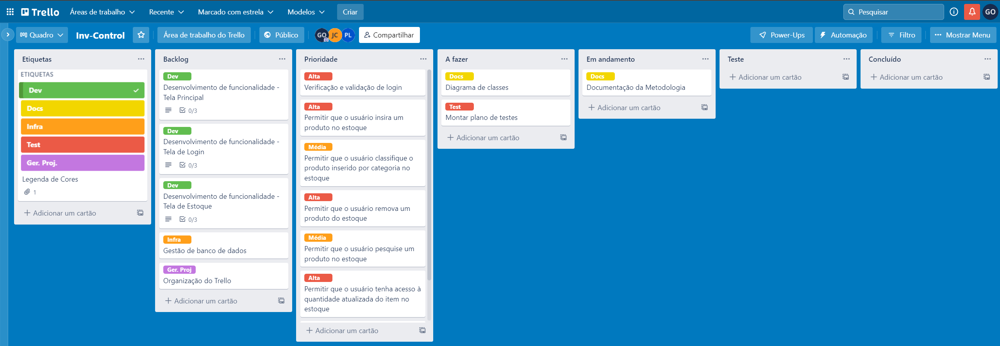
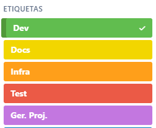

# Metodologia

Pré-requisitos: <a href="2-Especificação do Projeto.md"> Documentação de Especificação</a>

Descreva aqui a metodologia de trabalho do grupo para atacar o problema. Definições sobre os ambiente de trabalho utilizados pela  equipe para desenvolver o projeto. Abrange a relação de ambientes utilizados, a estrutura para gestão do código fonte, além da definição do processo e ferramenta através dos quais a equipe se organiza (Gestão de Times).

## Controle de Versão

A ferramenta de controle de versão adotada no projeto foi o
[Git](https://git-scm.com/), sendo que o [Github](https://github.com)
foi utilizado para hospedagem do repositório.

O projeto segue a seguinte convenção para o nome de branches:

- `main`: versão estável já testada do software
- `unstable`: versão já testada do software, porém instável
- `testing`: versão em testes do software
- `dev`: versão de desenvolvimento do software

Quanto à gerência de issues, o projeto adota a seguinte convenção para
etiquetas:

- `documentation`: melhorias ou acréscimos à documentação
- `bug`: uma funcionalidade encontra-se com problemas
- `enhancement`: uma funcionalidade precisa ser melhorada
- `feature`: uma nova funcionalidade precisa ser introduzida

Discuta como a configuração do projeto foi feita na ferramenta de versionamento escolhida. Exponha como a gerência de tags, merges, commits e branchs é realizada. Discuta como a gerência de issues foi realizada.

> **Links Úteis**:
> - [Tutorial GitHub](https://guides.github.com/activities/hello-world/)
> - [Git e Github](https://www.youtube.com/playlist?list=PLHz_AreHm4dm7ZULPAmadvNhH6vk9oNZA)
>  - [Comparando fluxos de trabalho](https://www.atlassian.com/br/git/tutorials/comparing-workflows)
> - [Understanding the GitHub flow](https://guides.github.com/introduction/flow/)
> - [The gitflow workflow - in less than 5 mins](https://www.youtube.com/watch?v=1SXpE08hvGs)

---

## Gerenciamento de Projeto
Nossa equipe utiliza metodologias ágeis, tendo escolhido o Scrum como base para definição do processo de desenvolvimento.

A equipe está organizada da seguinte maneira:
-	Scrum Master: 
    -  `Gustavo Alves Oliveira`
-	Product Owner:
    -  `Eduardo Vinicius Rodrigues Silva`
-	Equipe de Desenvolvimento:
	-    `Henrique Balmant Rocha Araújo`
	-    `José Carlos da Costa Júnior`
	-    `Pedro Henrique Lino Raimundo`
-	Equipe de Design:
    -	`Jefferson Filho`

Para organização e distribuição das tarefas do projeto, a equipe utiliza o Trello, o qual é estruturado com as seguintes listas: 
-	<b>Backlog</b>: Recebe as tarefas a serem trabalhadas e representa o Product Backlog. Todas as atividades identificadas no decorrer do projeto também vão ser incorporadas a esta lista.

-  <b>Prioridade</b>: Esta lista detalha a prioridade dos requisitos do software

-	<b>A Fazer</b>: Esta lista representa o Sprint Backlog. Este é o Sprint atual que estamos trabalhando.

-	<b>Em andamento</b>: Quando uma tarefa tiver sido iniciada, ela é movida para cá.

-	<b>Teste</b>: Checagem de qualidade. Quando as tarefas são concluídas. No final da semana, eu revejo essa lista para garantir que tudo saiu perfeito.

-	<b>Concluído</b>: Nesta lista são colocadas as tarefas que passaram pelos testes e controle de qualidade e estão prontos para ser entregues ao usuário.

O quadro kanban do grupo no Trello está disponível através da URL: https://trello.com/b/8lJOQrrJ/inv-control e é apresentado na imagem abaixo.

###### Tela do kanban utilizada pelo grupo

---

As tarefas são etiquetadas em função da natureza da atividade e seguem o seguinte esquema de cores/categorias:
-	Desenvolvimento 
-	Documentação                                 
-	Infraestrutura
-	Testes
-	Gerência de Projetos.

---
