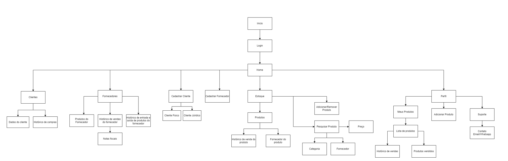
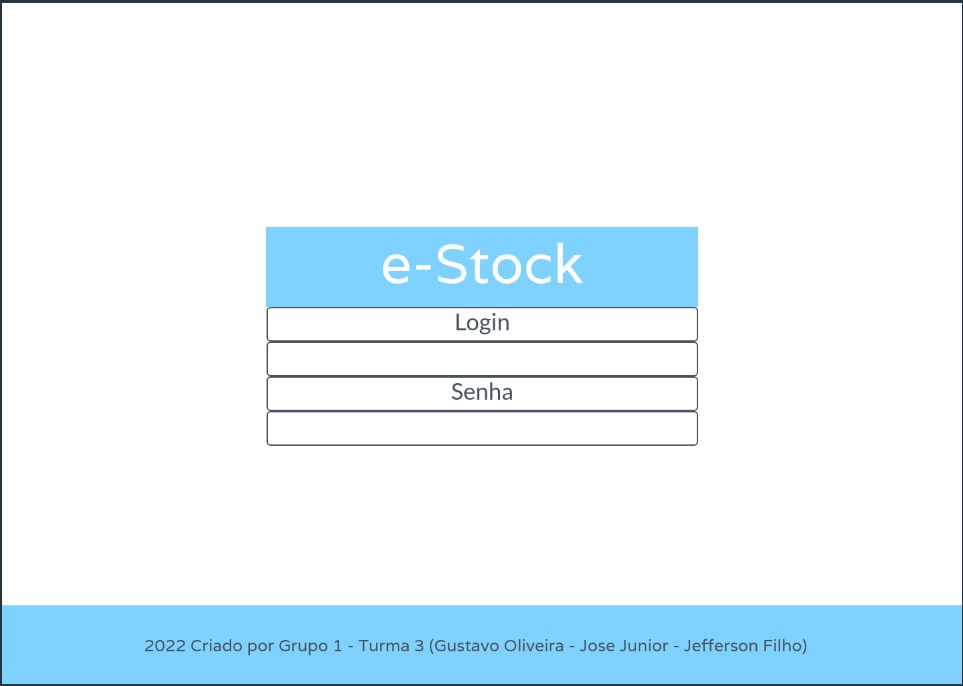
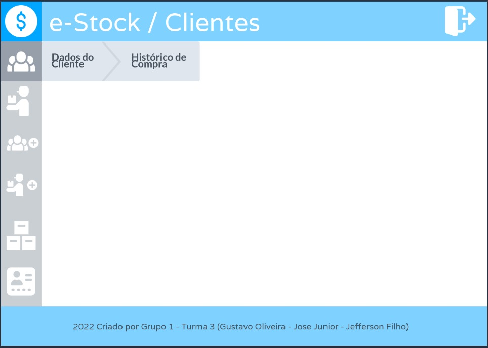
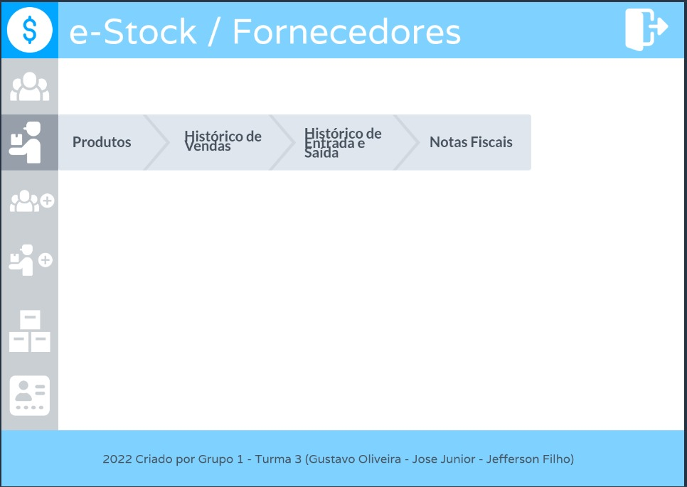
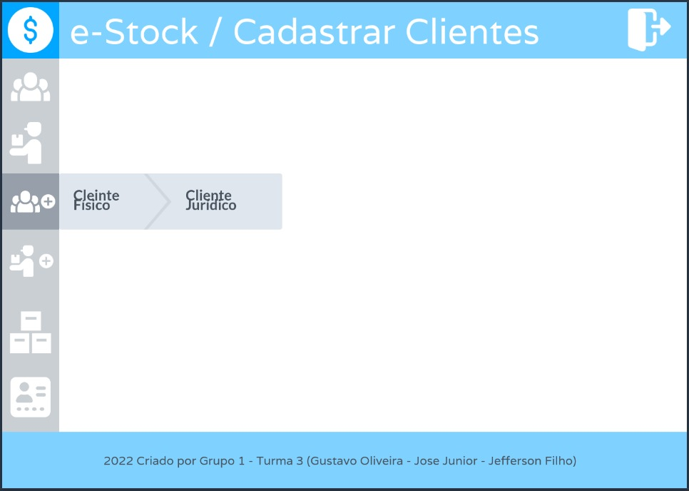
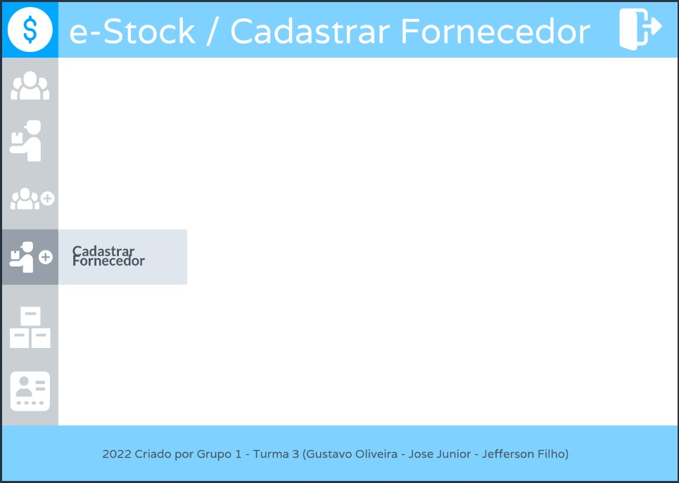

# Projeto de Interface

## Diagrama de Fluxo

O diagrama apresenta o estudo do fluxo de interação do usuário com o sistema interativo e  muitas vezes sem a necessidade do desenho do design das telas da interface. Isso permite que o design das interações seja bem planejado e gere impacto na qualidade no design do wireframe interativo que será desenvolvido logo em seguida.

###### Desenvolvido no "Draw.io"
---

## Wireframes

Conforme fluxo de telas do projeto, apresentado no item anterior, as telas do sistema são apresentadas em detalhes nos itens que se seguem. As telas do sistema apresentam uma estrutura comum. 

### Tela - Início 

A tela de home-page mostra uma breve mensagem de apresentação da Plataforma. 

---
### Tela - Login 

A tela permite o acesso à Plataforma. 

---
### Tela - Home 

A tela permite o acesso às funcionalidades da Plataforma. 

---
### Tela - Clientes 

A tela permite o acesso às funcionalidades da Plataforma relacionadas aos Clientes. 

---
### Tela - Fornecedores

A tela permite o acesso às funcionalidades da Plataforma relacionadas aos Fornecedores. 

---
### Tela - Cadastrar Clientes

A tela permite o acesso às funcionalidades da Plataforma relacionadas ao Cadastro de Clientes. 

---

### Tela - Cadastrar Fornecedores 

A tela permite o acesso às funcionalidades da Plataforma relacionadas ao Cadastro de Fornecedores. 

