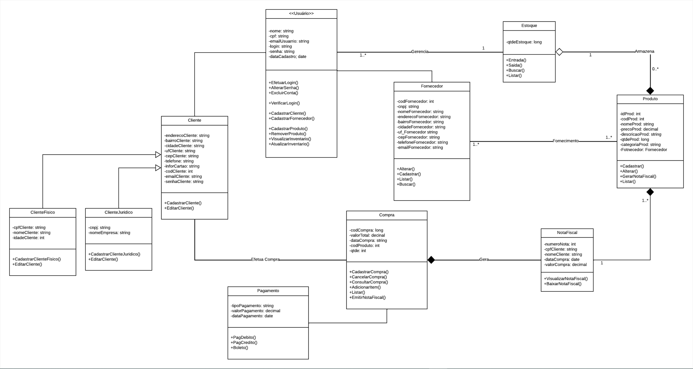
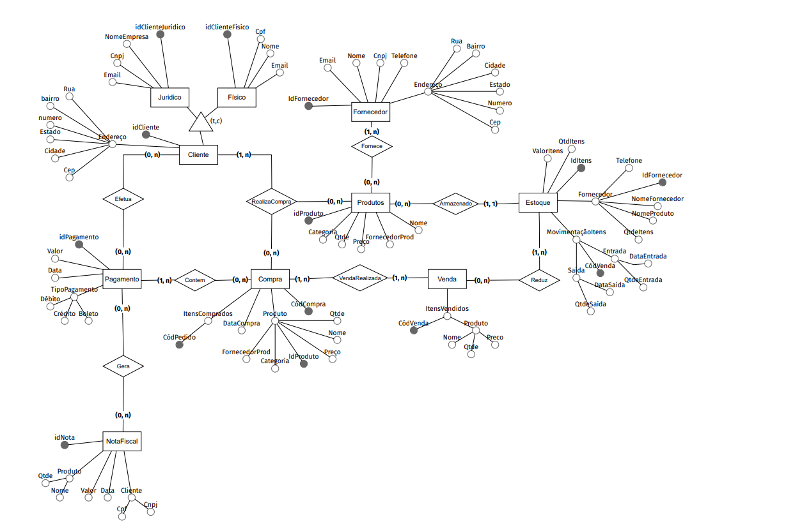
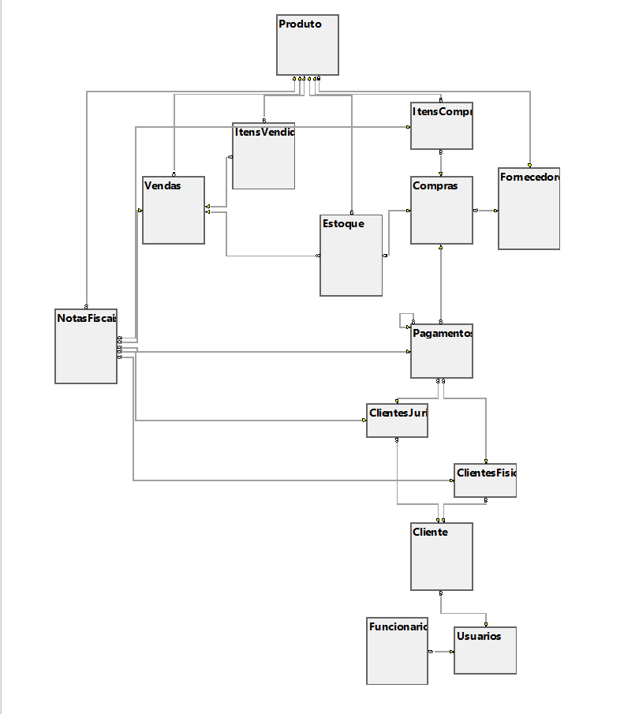

# Arquitetura da Solução

Definição de como o software é estruturado em termos dos componentes que fazem parte da solução e do ambiente de hospedagem da aplicação.

## Diagrama de Classes

Na imagem abaixo é apresentado o diagrama de classes do projeto.

###### Desenvolvido no "LucidChart"

---

## Modelo ER (Projeto Conceitual)

Abaixo é apresentado o modelo de entidade e relacionamento (MER) do projeto.

###### Desenvolvido no "BR Modelo Web"

---
## Projeto da Base de Dados

O Projeto da Base de Dados corresponde à representação dos dados em tabelas juntamente com as restrições de integridade e chave primária.
 

## Tecnologias Utilizadas

<b>IDE:</b>
- `VisualStudio 2022`

<b>Linguagens:</b>
- `C#`
- `Html`
- `Css`
- `JavaScript`

<b>Frameworks:</b>
- `ASP.NET Core` 
- `Bootstrap `
- `EntityFramework.`
  
<b>Banco de dados:</b> 
- `Microsoft SQL Server 2019`
  
<b>Pacotes:</b> 
- `XPagedList`
- `ClosedXML`
- `BCrypt.Net-Next`
- `Microsoft.EntityFrameworkCore.Tools`
- `Microsoft.EntityFrameworkCore.SqlServer`
- `Microsoft.VisualStudio.Web.CodeGeneration.Design`

## Hospedagem

A aplicação utiliza a plataforma `SmarterASP.NET` como ambiente de hospedagem do projeto.

A aplicação é mantida na seguinte URL:

http://josecosta1984-001-site3.etempurl.com/