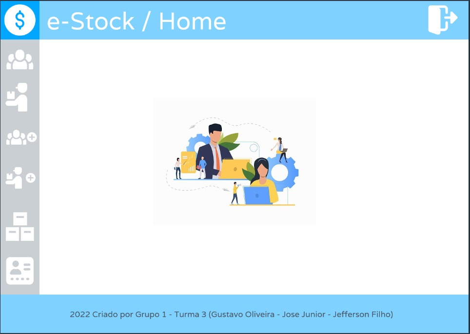
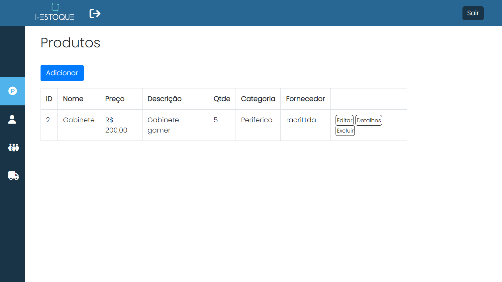
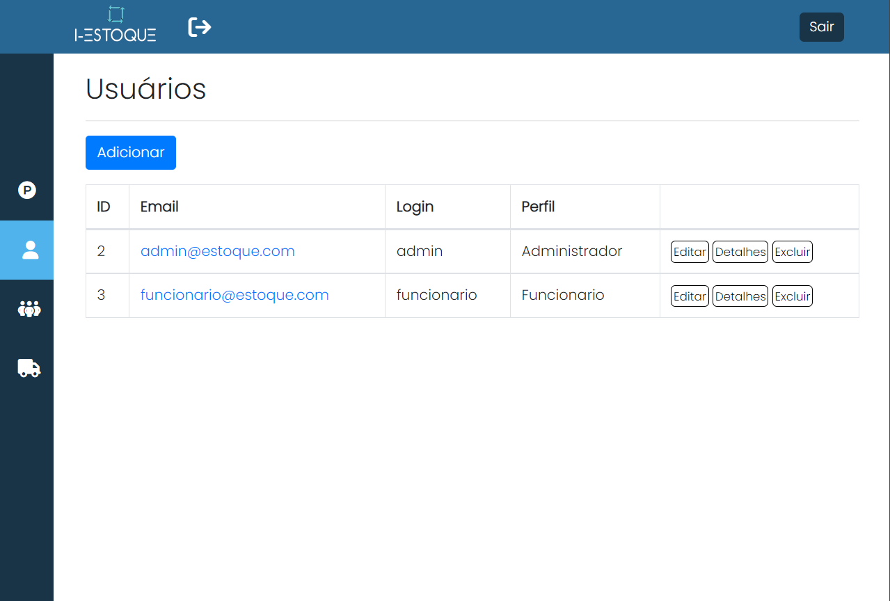
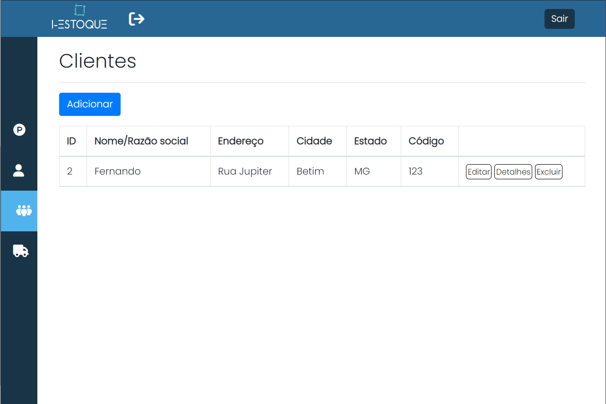
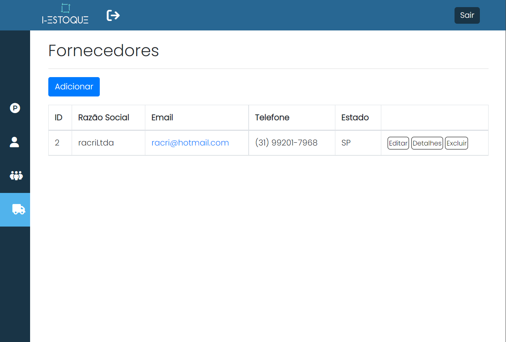
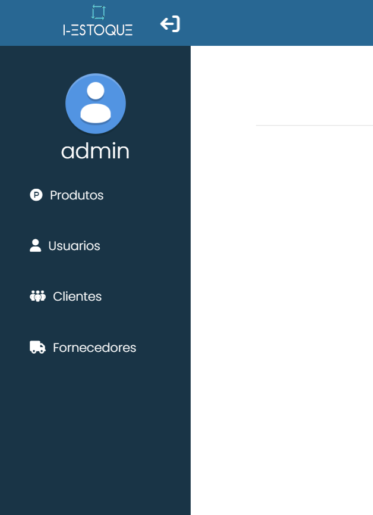

# Template Padrão da Aplicação

O padrão de layout a ser utilizado pela aplicação tem correspondência ao projeto de interface elaborado anteriormente, na figura abaixo.

---
## Tela Principal

Tela que abrange todas as visualizações iniciais do site como o menu, as tabelas e a homepage.

---
## Tela de Produtos
Tela que abrange a visualização da tabela de produtos.

---
## Tela de Usuários
Tela que abrange a visualização da tabela de usuários.

---
## Tela de Clientes
Tela que abrange a visualização da tabela de clientes.

---
## Tela de Fornecedores
Tela que abrange a visualização da tabela de fornecedores.

---
## Menu
Menu lateral de navegação.

---
## Tela de Login
Visualização da tela de Login da aplicação.

