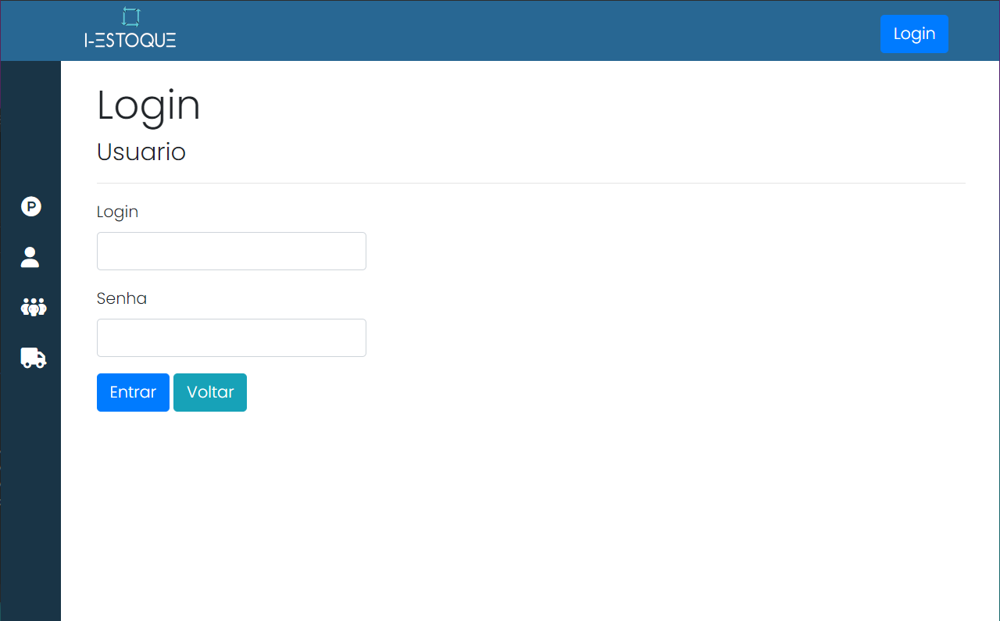
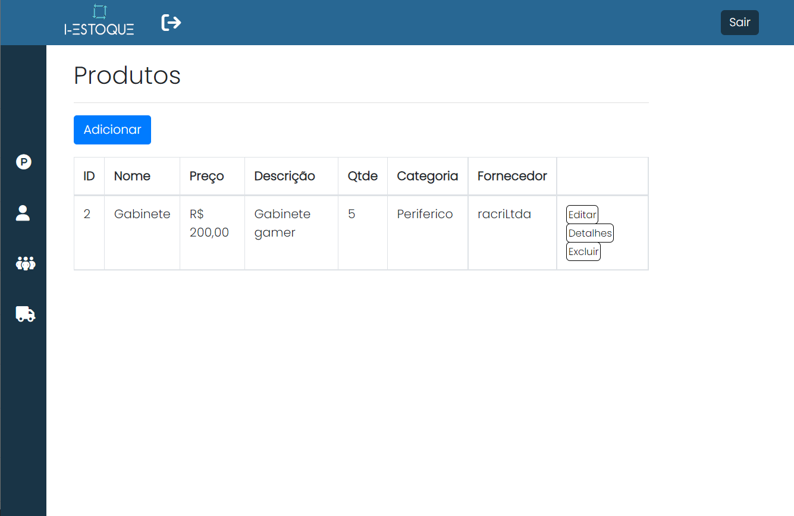
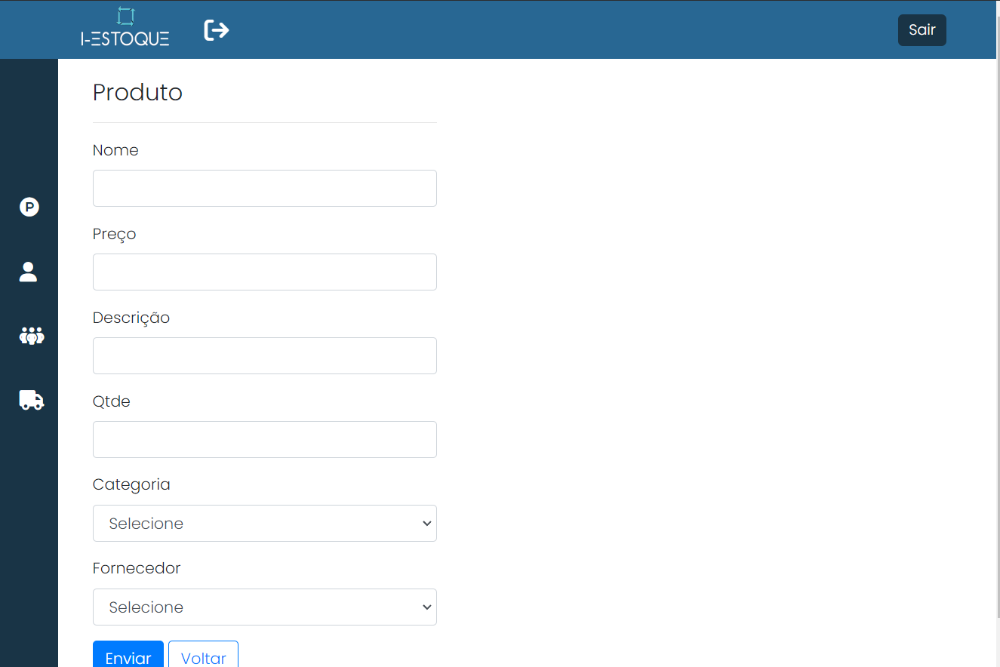
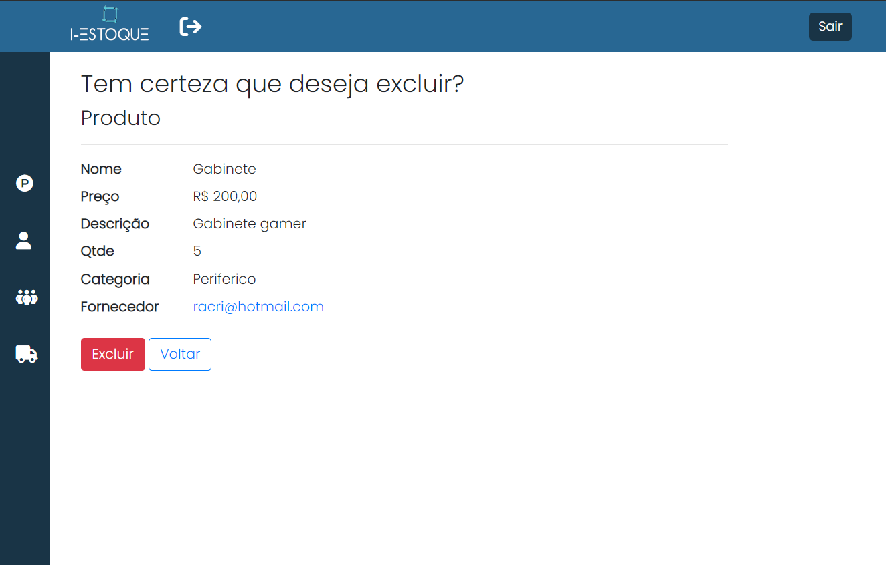
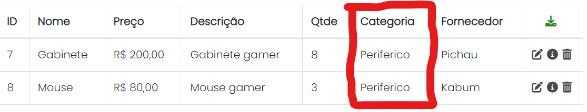
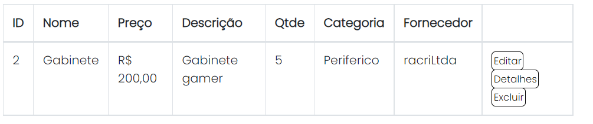
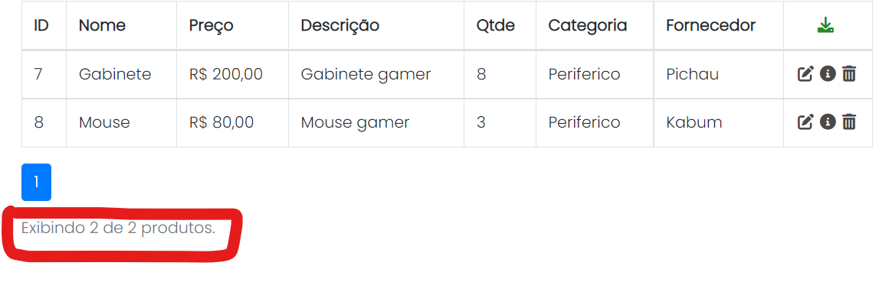
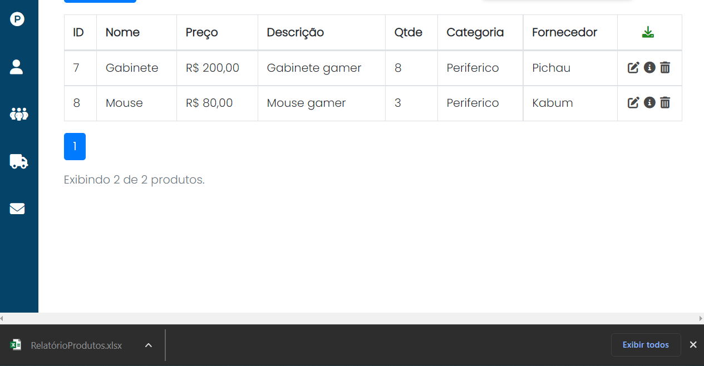
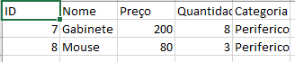

# Registro de Testes de Software

| Testes 	| CT 01 – Efetuar login |
|:---:	|:---:	|

| Testes 	| CT 02 – Adicionar produto no estoque |
|:---:	|:---:	|

| Testes 	| CT 03 – Permitir o usuário remover um produto do estoque |
|:---:	|:---:	|

| Testes 	| CT 04 – Classificar produtos por categoria no estoque |
|:---:	|:---:	|

| Testes 	| CT 05 – Mostrar quantidade de items individuais no estoque |
|:---:	|:---:	|

| Testes 	| CT 06 – Quantidade de itens totais no estoque |
|:---:	|:---:	|

  
| Testes 	| CT 07 – ID dos produtos no estoque |
|:---:	|:---:	|

| Testes 	| CT 08 – Gerarrelatorio da tabela de produtos |
|:---:	|:---:	|

---

## Avaliação

Todas as funcionalidades feitas até o momento funcionam perfeitamente, faltando apenas implementar as que faltam para a aplicação
